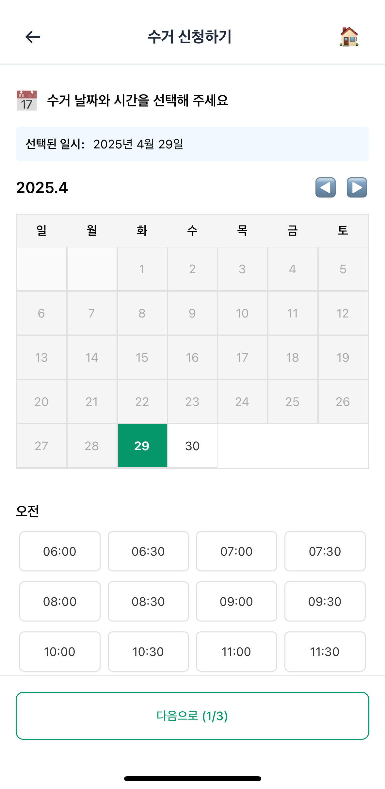
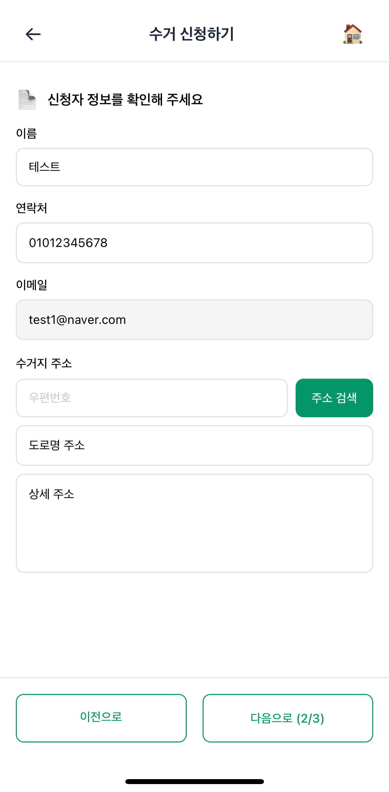
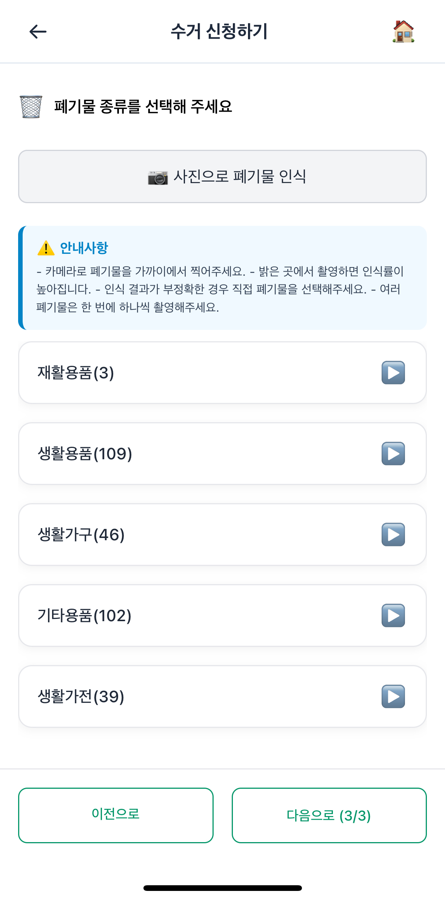
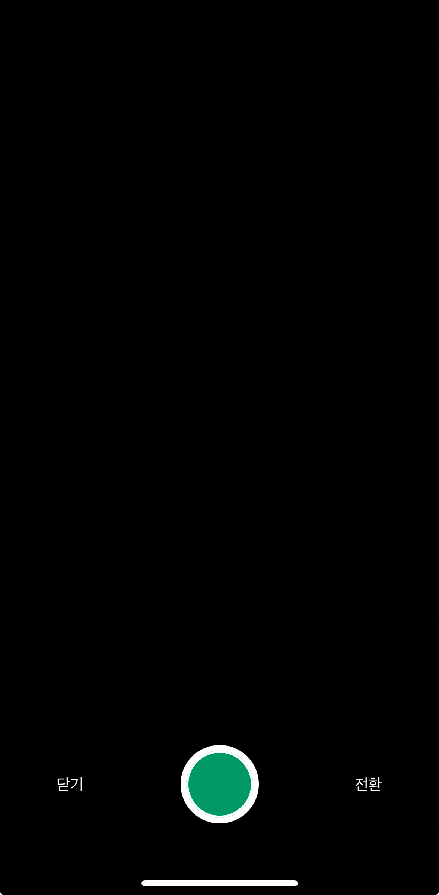
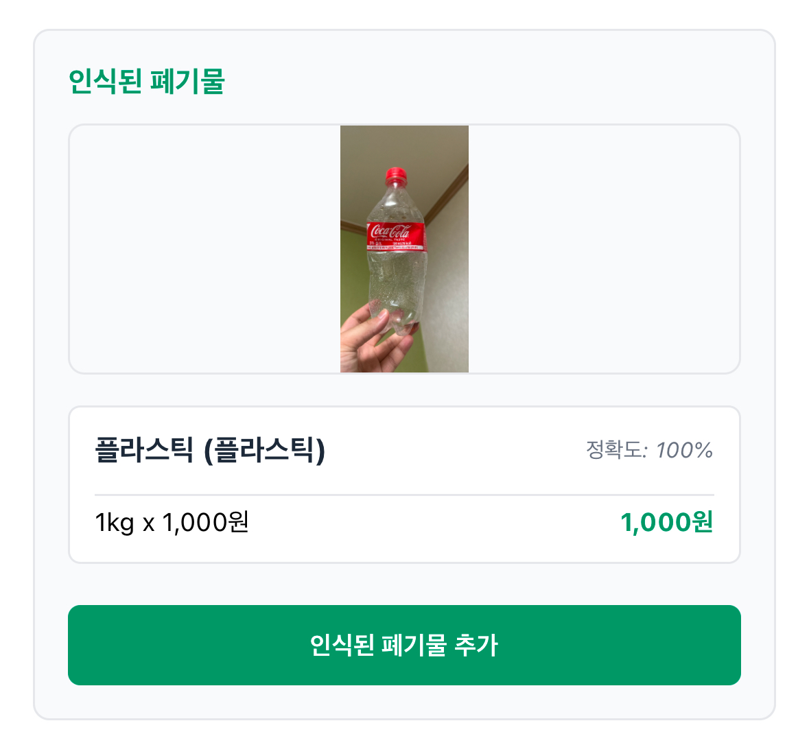

<h1 align="middle">Refresh_APP</h1>

  
  <h2>자구를 다시 새로고침 때까지, 새로고침</h2>

## 📱 프로젝트 소개

기존 웹 서비스(https://refresh-f5.store)를 React Native 기반 하이브리드 앱으로 확장한 프로젝트입니다. 앱에서는 YOLO 모델을 활용한 폐기물 자동 인식 기능을 구현하여, 사용자가 카메라로 촬영만 하면 폐기물 종류를 자동으로 판별하고 수거 신청을 도와주는 서비스를 제공합니다.

접근성을 고려해 웹 서비스를 하이브리드 앱으로 개발하였으며, 폐기물 인식 기능뿐만 아니라 담당자와의 실시간 채팅, 업사이클링 제품 구매 기능도 통합되어 있어 환경 보호와 자원 순환의 전 과정을 하나의 앱에서 경험할 수 있습니다.

## 🛠️ 기술 스택

- **프레임워크**: React Native
- **AI 모델**: YOLOv8 (custom-trained)
- **AI 서버**: Flask, PyTorch

## 🌟 주요 기능

- 웹뷰 기반 기존 서비스 통합
- YOLOv8 모델 기반 폐기물 자동 인식
- 40여 종의 폐기물 자동 분류
- 수거 날짜/시간 선택 및 예약
- 폐기물 종류 선택 (카메라 인식 또는 직접 선택)
- 수거 신청 완료 및 접수번호 발급

## 👨‍💻 개발자 정보

| 이름 | [손경락](https://github.com/ganglike248) | [서동섭](https://github.com/dongsubnambuk) | [한동균](https://github.com/hdg5639) |
| :-: | :-: | :-: | :-: |
| 프로필 |  |  |  |
| 기술 스택 |  |  |  |
| 담당 역할 | 수거신청 웹버전 개발 | React Native 애플리케이션 개발, YOLO 객체 인식 서버 구현, 실시간 폐기물 분류 시스템 통합, 수거신청 앱버전 개발발 | 유저 관련 서버 담당, 폐기물 API 제공 |
## 📱 스크린샷

| 날짜 선택 | 정보 입력 | 폐기물 선택 | 
|----------|----------|------------|
|  |  |  

| 카메라 화면 | 인식 결과 |
|------------|----------|
|  |  |

  © 2025 TEAM_F5. All Rights Reserved.

